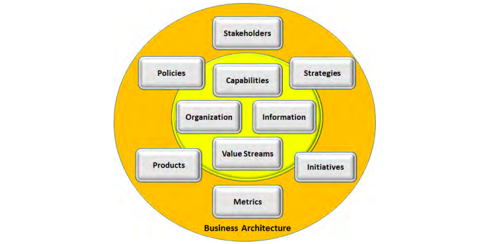
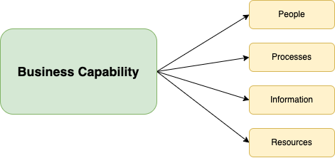
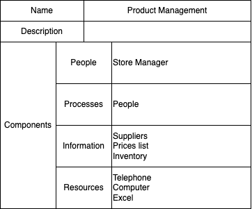
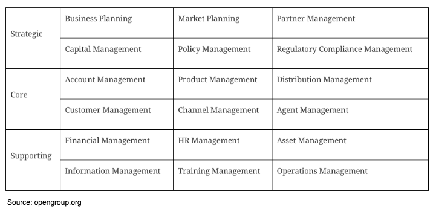
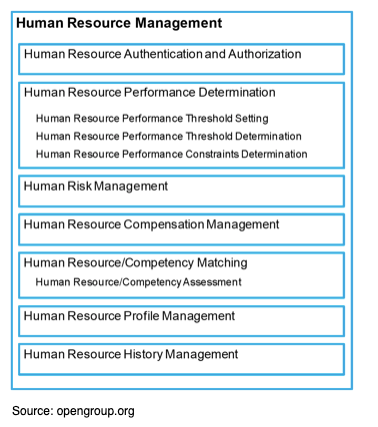
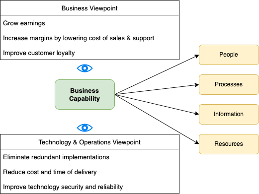

fee.org

In the past 3 months my curiosity drove me to business architecture. I read multiple articles and I landed in rabbit hole which increased my curiosity. During the process, I discovered multiple frameworks addressing business architecture but I stuck with "Guide to the Business Architecture Body of Knowledge".[#3]. The guide outlines that there are four core elements of business Architecture which includes:
1. Business Capability Map
2. Value Stream map
3. Information map
4. Organisation Map

This post focuses on Business Capability Map. The post defines business capability, business capability map and discusses the benefits of creating a business capability map.
<!--truncate-->

## What is business Capability?
Business capability represents the ability of a business to do something [#1]. 
It focuses on  what the business does, not how it does it. In a nutshell, business capabilities provide the building blocks upon which organisation execute an organisation’s business model. 

In order for the business capability to be defined, it is important to understand **elements that enables** a business capability which includes people, processes, information and resources.

#### People
People represents individual actors, stakeholders, business units, or partners involved in delivering business capability. [#1]

#### Processes
Business capabilities may be enabled or delivered through a number of business processes [#1]. Processes clarifies how the business is done. Documenting the processes that makes up the capability can help organisation identify loop holes and improve the capability where necessary.

Processes must be self contained within the business capability to provide focus for maturing the capability [#1]. This means we should be able to separate capability processes from value streams which focuses on delivering end-to-end value to the stakeholder. 

#### Information
According to [#1], “Information represents the business data, knowledge, and insight required or consumed by the business capability”. Capability can exchange information with other capabilities to support value streams.

#### Resources
Business capabilities rely on tools or assets like 
- Systems or applications
- Physical assets like buildings and machines
- Intangible assets like intellectual property

## Defining Business capability
It is recommended that business capability is defined in noun-verb format. e.g Product Development.
Each Business Capability needs to be accompanied by a description. It is recommended that the description should be inline of “Ability to do X” where X can be “develop product which includes all the restrictions and parameters to provide value to our clients”

According to [William Ulrich](https://www.bainstitute.org/resources/articles/defining-business-capability-cheat-sheet), organisations can use below guide to define business capabilities.

- Business capability is what is been done,  not how it’s done. Emailing or Faxing are not capabilities, they describe **how** capability is done. Capital management is the capability because it describes **what** is being done.
- Ensure business capability is not a process or value stream. Anything that requires movement and engages in sequence of activities is a value stream or process e.g. authorising.
- Business capabilities must be clearly defined. When we have product Management as capability, we need to clearly define the Product, and clearly define what we really mean by Management. Describing Product Management as "Ability to manage a product" is not ideal.
- Business capabilities are purely business views of the business. It is important remove the IT or systems view when identifying business capabilities. It is a business capability whether is done in a manual fashion, or it’s automated using IT systems

Below table highlights how an ogranisation can choose to define a business capability.

## Business Capability Map
Business capability Map is the representation of organisational business capabilities, at an appropriate level of decomposition, logically grouped into different categories. 

Business capability map provide self-contained view of the business. It does not represent
- Organisational Structure
- Business processes
- Representation of systems or applications

If there is a request to represent other view points, it is important to tap into other pillars of business architecture like value stream map, information map or organisation map. 

Business capability map promotes common understanding of the business across different business units. 

### Structuring Business Capability Map
There are 2 ways to structure a business capability map
- Stratification
- Leveling

#### Stratification
It is a process to grouping business capabilities within categories or layers.
Each layer provides different perspective to different stakeholders. For example, an organisation 
1. Top Layer (Strategic): focuses on capabilities related to strategy and and business directions normally targeting executive or drivers of the business
2. Middle Layer (Core): focusing on customer-facing element of business
3. Bottom Layer(Supporting): focusing on lower level capabilities crucial to run the business but not visible to the client.

Below is the level 1 business capability model

#### Leveling
Leveling is the process of decomposing top-level capabilities into lower level capabilities.[#1]. Different stake holders are interested in different level of capabilities. For example, executives or direction drivers might not be interested on level 3 of capabilities but engineers might be interested. 

## Benefits of Business Capability Mapping
Business capabilities provide and abstraction of the business reality in a way that helps to simplify the conversation between interested stakeholders[#1]

Some of the key benefits of Business Capability Map includes:
1. Providing common language regarding what the business does.
2. Encourage relationship within the business because it highlights who is responsible to bring the capability to life.
3. Helps organisation to highlight key capabilities to encourage focused investments.
4. Provides a foundation to create other core business architecture elements like value organisation map, value stream map and information map.

## Conclusion
Documented or undocumented, every business has building blocks(business capabilities) for executing business model. In a case where building blocks are not documents, organisation might experiences the gap between different business units or structures especially in large companies. 

Documenting business capabilities and creating business capability map is the first step to bring employees close to each other. Below figure highlights that different stakeholders within the business have different roles and viewpoints. The figure shows how business capability can be the glue to bring the stakeholders together.

## Reference

#1: [Business Capabilities,Version 2](https://pubs.opengroup.org/togaf-standard/business-architecture/business-capabilities.html#_Toc95135880)

#2:[William Ulrich](https://www.bainstitute.org/resources/articles/defining-business-capability-cheat-sheet)

#3: [A Guide to the Business Architecture Body of Knowledge® (BIZBOK® Guide)](https://cdn.ymaws.com/www.businessarchitectureguild.org/resource/resmgr/bizbok_8_5/bizbok_v8.5_final_part1.pdf)