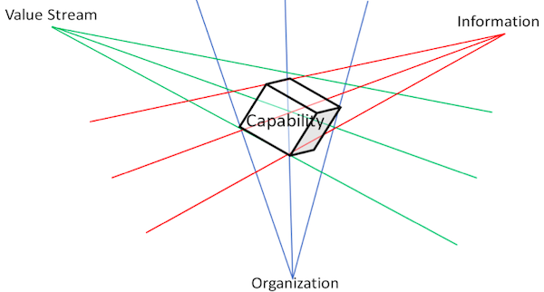
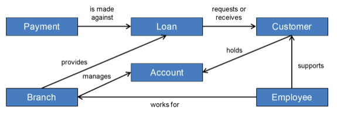
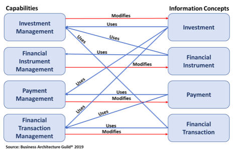

businessarchitectureguild.org

Capabilities are the foundation of other important viewpoints and techniques that can be used to move the business forward. 

This post highlights how business capabilities can be used in other core domains of business architecture. 
Furthermore, the post highlights how capabilities can be used in techniques like heat mapping and planning.
<!--truncate-->

### Organisation mapping
Organization map is one of the 4 pillars of Business architecture. 
Mapping business capability to organization highlight “Who” delivers the capability. Business capabilities executed in many different parts of the organization can lead to inconsistencies and inefficiencies. #[1]

Mapping capabilities to an organization can help highlight an opportunity to rationalize and save costs. 

### Information Mapping
Information map is a collection of information concepts and their relationship to one another.[#4]

Information Mapping provides the means to articulate and visually represent information that is critical to the business. 

Once information Map is established, it can be linked to business capabilities. Business capabilities require and update information concepts.

### Value Stream Mapping
Value Stream represents the sequence of activities(Value stages) to deliver on stakeholder requests.[#1]. A stakeholder can be a client or an internal user.

By mapping value streams to capabilities, the picture will be clear on which business capabilities are required to deliver value to the stakeholder.

Mapping key value stream to capabilities is important because its highlights capabilities used by multiple value streams. Once the organization identifies those business capabilities, the following questions should be asked
- What is the level of maturity of the business capability?
- How effective is the business capability?
- Can we scale the business capability? At what cost?
- Are we investing enough funds to the maturity and effectiveness of the business capability?

Providing honest answers to the questions above is the contribution to some of the heat maps mentioned in the heat map section.

#### Capabilities in Business Process Mapping

There is a grey area between business processes and value streams. In this post, 
- Business process is the process contained (Starts and ends) within business capability that is used to enable business capability. Does it need data and operations from other capabilities? Answer is YES
- Value Stream is the high-level business process that delivers value in stages to the stakeholder. 

The previous post suggests that business capability should be defined as per the below table.

Once the capability is defined, processes within the capability should be documented. 

### Heat Mapping
Heat mapping is a technique that helps identify opportunities for business improvement and investment. It can help an organization to highlight below for each business capability
- Maturity or strategic contribution, 
- Criticality, 
- Effectiveness or performance, 
- Value contribution or 
- Cost contribution

For example, an organization can create a maturity heat map using below color indicator
- Green: the desired level of maturity
- Yellow: Almost at maturity but the organization needs to work on it
- Red: lots of improvement needed
- Purple: capability needed by the organization but does not exist.

### Capability based planning
Capability-based planning focuses on the planning, engineering, and delivery of strategic business capabilities to the enterprise.[#3]. 

The below figure highlights that for capability-based planning to take place, capabilities must be defined.

## Conclusion
Capabilities, Value Stream, Information, and Organisation are the core domains of business architecture. This post made it clear that capabilities are the center or focal point of business architecture. Capabilities are the key that allows us to relate value streams, information, and organization

## Reference

#1: [Business Capabilities, Version 2](https://pubs.opengroup.org/togaf-standard/business-architecture/business-capabilities.html#_Toc95135880)

#2: [A Guide to the Business Architecture Body of Knowledge® (BIZBOK® Guide)](https://cdn.ymaws.com/www.businessarchitectureguild.org/resource/resmgr/bizbok_8_5/bizbok_v8.5_final_part1.pdf)

#3: [Togaf Standard 9.2](https://pubs.opengroup.org/architecture/togaf9-doc/m/chap28.html)

#4: [Information Mapping](https://pubs.opengroup.org/togaf-standard/business-architecture/information-mapping.html)

#5: [Business Architecture Metamodel Guide](https://cdn.ymaws.com/www.businessarchitectureguild.org/resource/resmgr/public_resources/Business_Architecture_Metamo.pdf)