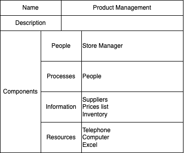

<!--  -->
fee.org

Business capabilities are the foundation of other important view points and techniques that can be used to move business forward. Because different people view organisation in their own unique view points, it is a good idea to use business capabilities as the base of those view points.

This post highlights view points or techniques that uses business capabilities as foundation.
<!--truncate-->

### Heat Mapping
Heat mapping is a technique that helps identify opportunities for business improvement and investment. It can help organisation to highlight below for each business capability
- Maturity or strategic contribution, 
- Criticality, 
- Effectiveness or performance, 
- Value contribution or 
- Cost contribution

For example, organisation can create a maturity heat map using below color indicator
- Green: at desired level of maturity
- Yellow: Almost at maturity but organisation needs to work on it
- Red: lots of improvement needed
- Purple: capability needed by organisation but does not exist.

### Capability based Planning
Capability-based planning focuses on the planning, engineering, and delivery of strategic business capabilities to the enterprise.[#3]. 

Below figure highlights that for capability based planning to take place, capabilities must be defined.

### Capability/Organisation mapping
Organisation map is one the 4 pillars of Business architecture. 
Mapping business capability to organisation highlight “Who” delivers the capability. Business capabilities executed in many different parts of the organisation can lead to inconsistent and inefficiencies. #[1]

Mapping capabilities to organisation can help highlight opportunity to rationalise and save costs. 

### Capability/Value Stream Mapping
Value Stream represents sequence of activities(Value stages) to deliver on stakeholder request.[#1]. Stakeholder can be a client or internal user.

By mapping value streams to capabilities, the picture will be clear on which business capabilities are required to deliver value to the stakeholder.

Mapping key value streams to capabilities is important because its highlights capabilities used by multiple value streams. Once the organisation identifies those business capabilities, following questions should be asked
- What is the level of maturity of the business capability?
- How effective is the business capability?
- Can we scale the business capability? At what cost?
- Are we investing enough funds to the maturity and effectiveness to the business capability?

Providing honest answers to the questions above is the contribution to some of the heat maps mentioned in the heat map section.

### Capability/Business Process Mapping

There is a grey area between Business process and Value stream. In this post, 
- business process is the process contained (Starts and ends) within business capability that is used to enable business capability. Does it needs data and operations from other capabilities? Answer is YES
- Value Stream is the high-level  business process that delivers value in stages to the stakeholder. 

The previous post suggest that business capability should be defined as per below table.

Once capability is defined, processes within the capability should be documented. 

### Capability/Information Mapping
Coming Soon

### Capability/Application Mapping

Coming Soon

### Service Model
As defined by BIAN,Coming Soon

## Conclusion
It is clear that business capabilities are glue in organisations. 

## Reference

#1: [Business Capabilities,Version 2](https://pubs.opengroup.org/togaf-standard/business-architecture/business-capabilities.html#_Toc95135880)

#2: [A Guide to the Business Architecture Body of Knowledge® (BIZBOK® Guide)](https://cdn.ymaws.com/www.businessarchitectureguild.org/resource/resmgr/bizbok_8_5/bizbok_v8.5_final_part1.pdf)

#3: [Togaf Standard 9.2](https://pubs.opengroup.org/architecture/togaf9-doc/m/chap28.html)