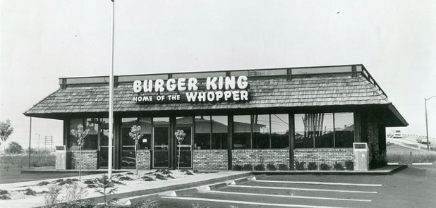
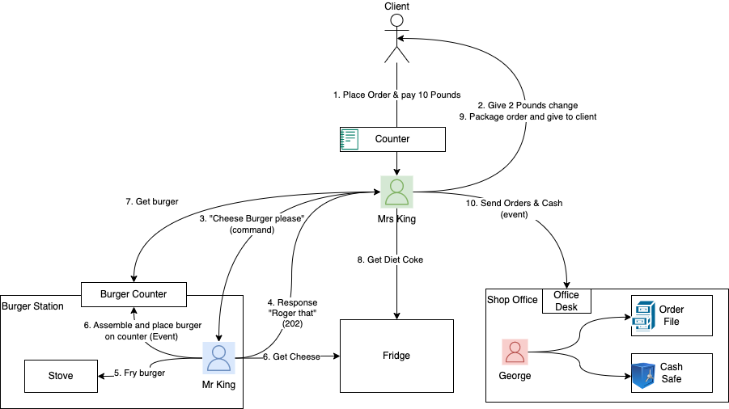
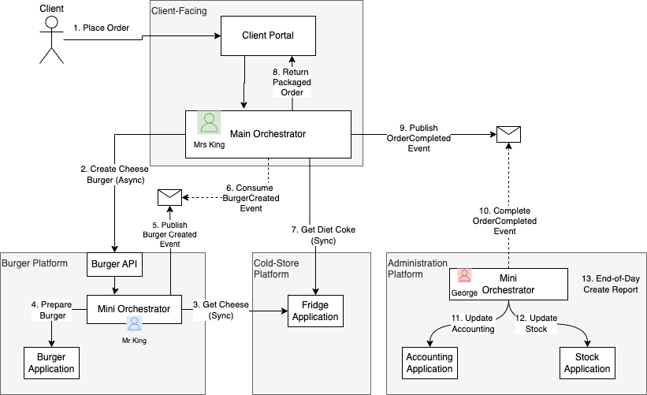

flickr.com

This article explains how to combine various applications to bring value to the client. It starts with a real-world example of a burger business and demonstrates how to use the saga pattern to construct a value stream integrating numerous applications.
<!--truncate-->

- Value stream is a sequence of activities that creates value for the client. From the viewpoint of the client, it represents a higher-level abstraction of the process.
- Saga is a sequence of local transactions. In this context, the saga pattern is used to implement value streams or processes.

Saga can be coordinated using **orchestration** pattern or **choreography** pattern as highlighted in [this post](https://nolomokgosi.com/blog/orchestrationvschoreography). The orchestration pattern is the main topic of this article.

The article outlines the roles of three participants in the value stream

1. Main Orchestrator
2. Mini Orchestrator
3. After-Effect

## Story Line
Mr. and Mrs. King decided to open a burger restaurant after retiring. They decided that Mrs. King would manage the counter once the shop opened, George, their son, would handle the accounting, and Mr. King would handle the burger-making and other back-office duties.

Their first client entered the store when it was first opened on May 28, 1984.

1. Client ordered a burger, chips, and a can of Diet Coke and gave Mrs King £20.
2. Mrs King took £20 and gave client £5.
3. Mrs. King shouted “Cheeseburger please” 
4. Mr. King shouted back “Roger that”.
5. Mr. King fried the burger patty, took cheese from the fridge, and assembled a burger.
6. After 5 minutes Mr King puts the burger and chips on the counter
7. Mrs King walked to the Burger counter to collect burger and chips
8. She then walked to the freezer and took a can of Coke
9. Mrs. King packaged the order and gave it to the client & client walked away

At the end of the day, Mrs. King would take the order book and cash to George so he can perform his bookkeeping duties.

In this process, one can tell that:

- Value Stream input is “Place Order” and output is “Receive Goods”.
- Mrs. King is the Main Orchestrator
- Mr. King is the Mini Orchestrator (a detailed process that forms part of a value stream)
- George plays the after-effect role. The role is important but does not affect the defined value stream.

The below diagram visualises the above-mentioned flow.

## Solution Design
Imagine we are tasked to create a solution based on the above-mentioned use case. We would begin by creating bounded-context platforms that include client-facing, burger, cold-store, and administration.

In our solution, 
1. Mrs. King & Counter would be applications within a client-facing platform. As “Main Orchestrator”, Mrs. King would be responsible for the client-related value streams & client experience.
2. Mr. King would be an application and orchestrator with a platform called Burger Platform. As the participant in out value stream, Mr. King would play the “Mini Orchestrator” role.
3. Fridge is an application within the Cold-Store platform. This application would be used in a synchronous fashion.
4. George would operate in the Administration Platform.

Below diagram would represent our solution design. Note the sync and async calls during the process.

## Conclusion

Creating value streams or business processes in a large organisation can be a challenging task. The ability to identify participants and the role they play requires effort & alignment across multiple teams.

To make things simpler, I recommend the following: 

1. Identify and design the value stream where the client, input & output is well defined (Input: Client buys a burger, Output: Client gets burger & diet coke).
2. Based on the value stream, create your saga (sequence of transactions). 
3. List the participants in each transaction. When necessary, follow domain-driven design guidelines.
4. Choose between the orchestrations-based saga and choreography-based saga. More info on this [blog post](https://nolomokgosi.com/blog/orchestrationvschoreography)
5. Identify after-effects participants. These are important participants but they are not involved in the defined value stream (banking cash & filing orders).  
6. Design your solution based on above

By following the recommended approach, organisations can achieve greater efficiency and improve client experiences.

