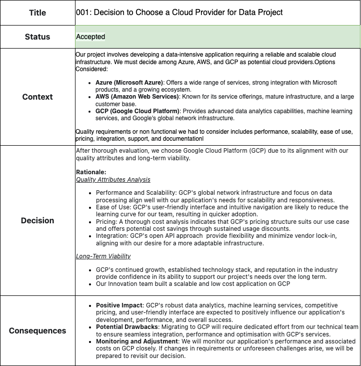

congerdesign

Have you ever looked back on something you did and wondered, "What was I thinking?" For me, it's when I see photos from my teenage years. Every time I go through them, I ask myself, "Why did I choose that hairstyle? Did I really think this was cool?". 

The fact is, at that time, it was cool. I liked the hairstyle of my favorite soccer player, and because of that, many kids in my school also had the same hairstyle. Therefore given the information and context I had, I made decisions that made sense. When others see the picture in my absence they might not understand the context because it's in my head.

In summary, some decisions are sensible if you understand the context. Context is KING.
<!--truncate-->
## Introduction

In the world of technology, specifically in architecture, decisions are an everyday occurrence. These decisions happen in meetings, around coffee machines, and sometimes even in offsite locations. We discuss the context of the decisions with groups of people, but we often neglect to document both the decisions and the reasoning behind them. Few years later, and we find ourselves looking at the architecture, wondering, "Why did we design it this way? What were they thinking?"

In those moments, if we're fortunate enough to have someone who was part of the decision-making process in the room, they can share the story which includes the constraints they faced at that time, such as time, cost, and resources. After that brief story, we then say, "Oh, that makes sense." Without someone who has the context, that understanding is lost.

To address this challenge of missing context, the solution is to document our decisions. You might be thinking, "Another document? No one reads documentation." Please give me just five minutes to explain how this approach could work for you and your organization.

## Architecture Decision Record (ADR)

An Architecture Decision Record (ADR) is a point-in-time document that records architectural decisions and the reasoning behind them.

Think of it as a snapshot that says, "On this date, given the context, drivers, and information we had, we made a decision to go with Option Z. We considered Options X, Y, and Z."

## Structure of an ADR

According to Michael Nygard on #1, an ADR should include the title, status, context, decision, and consequences. Additionally, I suggest adding the decision maker(s) and stakeholders.

**Title**: A brief document title, e.g., "001: Decision to Choose a Cloud Provider for Data Project."

**Created By**: Indicate the creator if the wiki doesn't provide details.

**Date**: The creation date of the ADR.

**Decision Maker**: The person(s) responsible for making the decision.

**Stakeholders**: Those offering advice and those affected by the decision.

**Status**: The status of the ADR (Draft, Accepted, Rejected, Deprecated by YYY, Supersedes XXX).

**Context**: This section highlights the problem statement, drivers (functional and non-functional), and options considered.

**Decision**: Document the chosen decision and its rationale.

**Consequences**: Detail the resulting context or state after implementing the decision, including trade-offs.
## How to create ADR

#### 1: Identify the need for an ADR
Before you start creating an ADR, ensure that the decision is significant enough to warrant documentation. Consider decisions that have a lasting impact on the architecture, technology choices, or design principles. Once need is identified, create ADR in “Draft” status on a standard organisation or team template. ADR should include
- Decision Maker(s)
- Stakeholders
- Problem Statement (In Context Section)

#### 2: Define the Problem
Clearly articulate the problem or challenge that the architectural decision aims to address. This sets the context for the decision and helps others understand why it's being made.

#### 3: Describe other options
List and describe the alternative solutions or approaches considered to solve the problem. Include both the pros and cons of each alternative. This provides a comprehensive view of the decision-making process.

#### 4: Collaborate
Engage listed decision makers to work on problem statement. Discuss all options and choose the winning solutions. Once all decision makers are aligned, engage stakeholders and expertise on the decision for review and approval (I call it a sales process). It's essential to engage stakeholders early because there might bring missing context which could changed your winning solution. 

#### 5: Record the Decision
Once you have all the green lights, change the status to decided. Document the chosen solution or approach as the decision and the rationale behind the decision. Highlight the reasons, benefits, and trade-offs associated with the decision. 

#### 6: Consequences
Outline the expected consequences of the decision. This includes both the positive outcomes and potential drawbacks. Consider technical, operational, and business impacts. 

#### 7: Maintain and Update
If a decision changes due to new information or evolving requirements, update the ADR to reflect the current state. Change the status of the current ADR to ”Deprecated by YYY” and ”Create a new one with status “Superseded by XXX”

By following these steps, teams will be able to create well-structured, informative, and valuable Architecture Decision Records. These records will contribute to better communication, knowledge sharing, and informed decision-making within the team and across the organization.

## ADR Example

## Benefits of ADR

| Benefit | Description |
| ----------- | ----------- |
| **Time and Cost saving** | Without documentation, decisions are revisited more often. ADRs brings new members of the team or organisation  up to speed on decisions made and the reason why they were made |
| **Distributed Decision Making** | ADRs helps teams to make informed decision and reach consensus more efficiently. They allow anyone in team to own or run with the decision making while ensuring that right stakeholders are involved |
| **Transparency** | Decisions made are not locked in meeting minutes or archive folder in document server. The collection of ADRs are accessebile and they can help in communication. |
| **Knowledge Sharing** | ADRs captures and preserves institutional knowledge by documenting insights, trade-offs, and lessons learned from past decisions. Because of individuals listed on the ADR, anyone can choose to have further conversations with those individuals|
| **Accountability** | Each decision is tied to specific individuals or groups, fostering accountability and ensuring that decisions align with the team or organisational goals and constraints.|

## Conclusion

Architecture Decision Records (ADRs) are commonly used in software design, but their benefits extend to various architectural domains such as Business, Data, Technology, and Application. 
We should give equal importance to **"documenting decisions"** as we do to creating diagrams and models, as decisions shape the context of both current and future designs.

It's essential to understand the purpose and scope of ADRs:

- ADR serves as a communication tool, enabling teams and stakeholders to grasp the reasoning behind decisions.
It acts as a decision tracking tool, helping us trace why decisions were made, especially when initial drivers evolve.
- ADRs are concise, usually one or two pages long.They should be readable within an average of 5 minutes, catering to both technical and non-technical audiences.
- ADRs are immutable; if revisiting a decision, update the existing ADR's status to "Superseded by XXX" and create a new ADR.

However, it's crucial to recognize what ADRs **are not**:

- ADRs are not long-running documents (e.g. user requirements document). They capture a snapshot at a specific point in time, and decisions should be reached in a manageable timeframe.
- ADRs don't replace conversations and collaborations. They document the outcomes of discussions.
- ADRs aren't limited to complex decisions. Simple decisions with long-term effects should be documented.

By understanding these distinctions, embracing ADRs across architectural domains, and valuing the practice of documenting decisions, we empower ourselves to make informed choices and build well-documented application.We will hardly get to the point were we say **"What were we thinking?"**

## Reference

#1 [DOCUMENTING ARCHITECTURE DECISIONS]( https://cognitect.com/blog/2011/11/15/documenting-architecture-decisions)

#2 [The Architecture Advice Process with Andrew Harmel-Law](https://www.infoq.com/podcasts/architecture-advice-process/)
