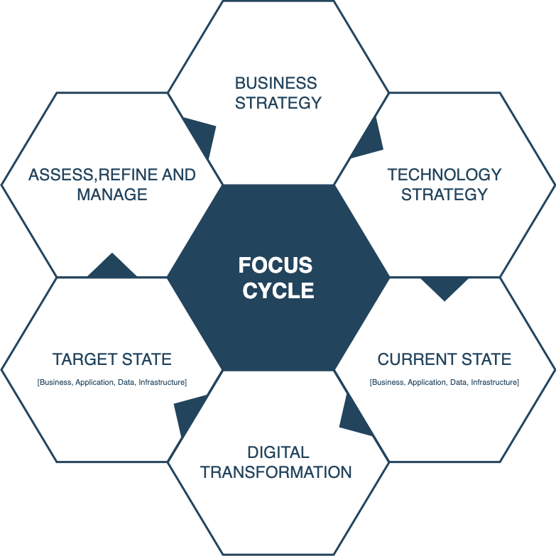

# Focus Cycle

In today's rapidly evolving digital landscape, the role of the Architecture has become increasingly critical. As organizations strive to leverage technology to drive business growth and remain competitive, the need for a well-defined and aligned architecture has never been greater.

This document outlines the key focus areas for modern Architects, emphasizing the importance of 6 key factors of the focus cycle.
Focus cycle brings together elements that will bring business objectives to reality. Note: This is note a framework, but mapping key factors of digital organisation. 

### 1. Business Strategy:

* **Deeply Understand the Business:**
    * Analyze business drivers, strategic goals, objectives, and initiatives.
    * Identify key performance indicators (KPIs) and how technology can impact them.
    * Develop a strong understanding of the business context, including industry trends, competition, and customer needs.

### 2. Technology Strategy:

* **Develop an Aligned Technology Strategy:**
    * Define a technology vision that supports and enables the business strategy.
    * Identify and prioritize technology investments that deliver the greatest business value.
    * Develop and communicate a clear technology roadmap to stakeholders.

    * **Architectural Foundation:**
        * **Establish Architectural Principles:** Guide technology decisions with clear and consistent principles (e.g., agility, scalability, security).
        * **Develop Architectural Roadmaps:** Plan the evolution of the enterprise architecture over time, considering technology trends and business needs.

    * **Data Strategy:**
        * **Data-Driven Decisions:** Develop a data strategy that supports business intelligence, analytics, and data-driven decision making.
        * **Data Governance:** Implement robust data governance practices to ensure data quality, security, and privacy.

    * **Infrastructure Strategy:**
        * **Cloud Computing:** Develop a cloud strategy that aligns with business needs and risk tolerance (e.g., public, private, hybrid cloud).
        * **Infrastructure Modernization:** Plan and execute infrastructure modernization initiatives to improve performance, efficiency, and agility.

    * **Security Architecture:**
        * **Proactive Security:** Design and implement a robust security architecture to protect organizational assets and data from threats.
        * **Threat Modeling:** Conduct regular threat modeling exercises to identify and mitigate potential security risks.

### 3. Current State Assessment:

* **Analyze the Existing Landscape:** 
    * Conduct thorough assessments of current IT infrastructure, applications, and processes.
    * Identify strengths, weaknesses, opportunities, and threats (SWOT analysis).
    * Document existing architecture and identify gaps and inconsistencies.

### 4. Transformation and Innovation:

* **Digital Transformation:** 
    * Lead and support initiatives to transform business processes and operations through technology.
    * Embrace emerging technologies (e.g., AI, ML, IoT) to drive innovation and competitive advantage.

### 5. Target State:**

* **Develop Target State:** 
    * Based on defined technology strategy (including with data,security,architecture), develop a north star
    * Bring all the key points from  digital transformation 

### 6. Refine and Management:
**Architecture**

* **Governance and Compliance:** Ensure adherence to architectural standards, policies, and industry regulations.
* **Modernization and Innovation:** Drive the adoption of new technologies and modernization initiatives to improve business agility and efficiency.
* **Continuous Improvement:** 
    * Monitor and evaluate the effectiveness of the enterprise architecture.
    * Gather feedback from stakeholders and incorporate it into the architecture.
    * Continuously refine and improve the architecture based on changing business needs and technology advancements.

**Stakeholder Management and Communication**

* **Build Strong Relationships:** Cultivate strong relationships with business stakeholders, IT teams, and other key decision-makers.
* **Effective Communication:** Communicate complex technical concepts clearly and concisely to both technical and non-technical audiences.
* **Change Management:** Lead and support change management initiatives related to IT transformations and architectural changes.

### Key Additions:

* **Detailed focus on business understanding:** Emphasizes the importance of deep business knowledge and alignment.
* **Expanded on technology strategy:** Includes specific areas like data strategy, infrastructure strategy, and security architecture.
* **Stronger emphasis on continuous improvement:** Highlights the iterative nature of architecture and the importance of ongoing monitoring, evaluation, and refinement.
* **Enhanced clarity and conciseness:** Improved the overall readability and flow of the content.

