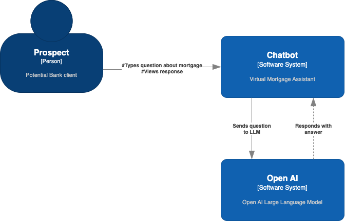
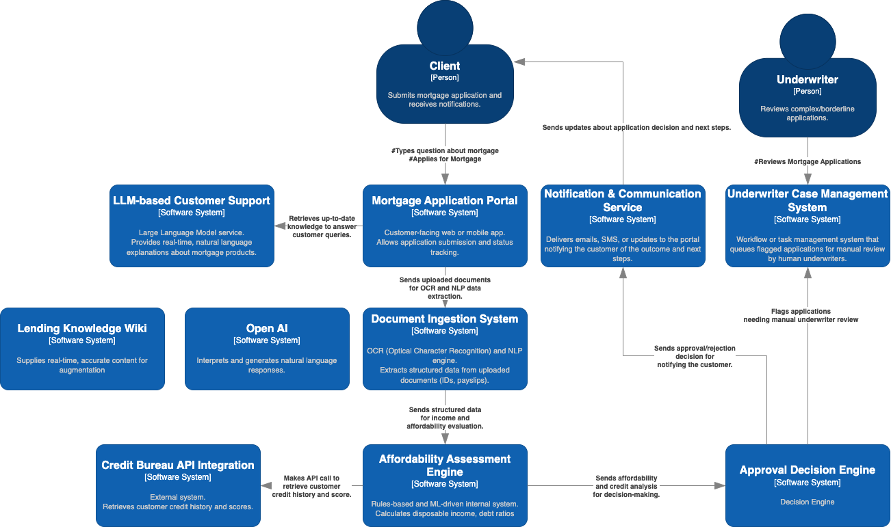

# AI Agents (aka Digital Coworkers)

## Context

  

Artificial Intelligence is no longer just a **back-office accelerator**—it’s becoming a **front-line business enabler**. While AI has been part of our digital strategies for years, the evolution toward Agentic AI marks a transformative shift. This new generation of AI can not only understand and respond—it can **plan, act, and learn**.

  

To fully appreciate this evolution, this document take a step-by-step journey: starting with Large Language Models (LLMs), then moving into AI Workflows, and finally diving into Agentic AI. Each section includes a real-world example with a detailed walk-through of the process—from request to resolution—with human involvement clearly highlighted.

  

  

## 1: Large Language Models (LLMs)

  

LLMs, or Large Language Models, are a type of artificial intelligence that uses deep learning techniques to **understand, generate, and manipulate** human language. They are trained on vast amounts of text data and can perform various natural language processing tasks like text generation, translation, and summarization. Applications like ChatGPT, Gemini, Claude are built on top LLMs.

  

Since they work on trained data, they don't have access to data outside of the trained data.

**Key Notes:**

  

-  **Stateless**: Responds to input but doesn't remember past interactions unless explicitly designed to.

-  **Reactive**: Waits for a prompt and then replies.

-  **Narrowly focused**: Excels in language-related tasks, like answering questions or generating content.

  

### Example: Virtual Mortgage Assistant:

A customer visits the bank’s website and asks: “How much can I borrow for a mortgage if I earn £45,000 a year?”

  

1.  **User Input**: The customer types the question into the mortgage chatbot interface.

2.  **LLM Invocation**: The chatbot passes the question to an LLM, which identifies the intent (mortgage affordability) and key variables (income).

3.  **Rule-Based Calculation**: The system queries affordability rules and calculates a general estimate based on internal policies (e.g., 4.5x salary).

4.  **Response Generation**: The LLM responds with: “Based on your income, you may be eligible to borrow approximately £202,500. For a personalized quote, we’ll need more details like your expenses and deposit amount.”

5.  **Output to User**: The answer is shown instantly in the chatbot window.

6.  **Optional Escalation (Human Involved)**: If the customer asks about tax impacts, shared ownership schemes, or regulatory clauses, the chatbot may escalate to a mortgage advisor.

  

  

  

## 2: AI Workflows

AI Workflows are orchestrated systems where multiple AI and non-AI components work together to complete an end-to-end business process. These include LLMs, computer vision, ML models, APIs, and rules engines.

  

They follow pre-defined path set by human called control logic. RAG (Retrive Augmented Generation) is an example of AI workflow that helps AI models look things up before providing an answer.

  

**Key Notes:**

-  **Process-driven**: Designed around a **predefined** sequence or flow of steps.

-  **Modular**: Different AI components can be connected in a pipeline.

-  **Partial automation**: Human-in-the-loop is common, especially for edge cases or approvals.

  

### Example: End-to-End Mortgage Application Processing

A customer applies for a mortgage through the bank’s digital portal.

  

  

Step-by-Step Flow:

  

1.  **Application Submission**: The customer submits income data, credit history consent, and uploads ID and payslips.

2.  **Document Ingestion (AI/ML)**: OCR and NLP extract data from the documents (e.g., salary, employer, ID details).

3.  **Credit Check (API Call + ML)**:An API request to credit bureaus retrieves the credit score and payment history.

4.  **Affordability Assessment (Rules + ML)**:An internal engine calculates disposable income and matches against mortgage criteria.

5.  **LLM Communication**:If the customer requests an explanation of mortgage types or term differences, the LLM generates simplified responses.

6.  **Approval Decision** (Rules Engine): A decision engine recommends approval or rejection based on policy thresholds.

7.  **Underwriter Review** (Human Involved): If the case is borderline or involves exceptions (e.g., unusual income sources), a human underwriter is flagged to review.

8.  **Notification**: The decision and next steps are shared with the customer via email or portal.

 **How LLM-based Customer Support Integrates with the LLM Model and Lending Knowledge Base**

LLM-based Customer Support Layer  is the  **customer-facing**  system. It handles  **questions**  from customers, like:
    
    -   “What’s the difference between fixed and variable mortgage rates?”
        
    -   “How long does a mortgage approval take?”
        
It acts as a  **communication bridge**  between the  **customer**  and the  **backend AI systems**.
   
Because the base LLM might not  **always know the latest**  mortgage rules, rates, or policies (because it was trained before those changes). The system uses Retrieval-Augmented Generation (RAG) to provide latest and company based results and also to avoid hallucination (wrong/confident guesses by the AI)
    

### Integration with the Lending Knowledge Base (using RAG)

    
-   Step by step process:
    
    1.  **Retrieve Phase**:
        
        -   Before answering, the system  **searches the Lending Knowledge Base**.
            
        -   It looks for  **relevant documents**  like latest mortgage policies, FAQs, terms, approval guidelines.
            
    2.  **Augment Phase**:
        
        -   The relevant information  **is injected into the LLM prompt**.
            
        -   Example:  
            Instead of just asking  _"What is the mortgage approval time?"_,  
            the system rephrases the query internally to:
            
            > "Based on these internal documents, answer the customer's question."
            
    3.  **Generation Phase**:
        
        -   The LLM  **uses the retrieved context**  and  **generates a precise, policy-compliant answer**.
            
  
  
----------
## 3. AI Agents

  

Agentic AI, or AI Agents, are autonomous systems that can **plan, make decisions, and take actions** to achieve specific goals.
Unlike static models, agents operate in a loop. They:
- Perceive their environment
- Reason about their options
- Plan
- Act/Execute actions 
- Learn from feedback.

 These agents loop through sensing, reasoning, acting, and learning—minimizing human intervention while adapting to real-world dynamics.

In Agentic AI, human (decision maker) is replaced by an agent. Where human human used to reason and act, the agent will do exactly that. Agents autonomously iterates until the best results are reached

**Key Notes:**

  

-  **Autonomous**: Can operate independently to achieve goals.

-  **Goal-oriented**: Works toward outcomes rather than single tasks.

-  **Continuous**: Maintains memory/state and updates strategies based on feedback.(This is thee gold about agents)
-  **Reasoning and planning**: Makes decisions dynamically, not just following a predefined path.

  

[c4 diagram]
### Example 1: End-to-End Mortgage Application Processing
Reimagining the example provided in  AI workflow case, the Mortgage application process will look like:

1.  **Application Submission (Customer → Agentic System)**

-   **Customer Action**: The customer submits their mortgage application via a digital portal, including personal information, financial data, and documents (ID, payslips, etc.).
    
-   **Agent**:
    
    -   The system  **autonomously validates**  that all required documents and data are submitted.
        
    -   It checks for  **format correctness**, completeness, and compliance with initial criteria.
        
    -   If any  **missing information**  or  **incorrect data**  is detected, the agent  **proactively**  notifies the customer and requests the necessary corrections, offering real-time feedback and suggestions.
        

2.  **Document Ingestion & Data Extraction (AI/ML Agent)**

-   **Agent**:
    
    -   An  **AI agent**  processes and  **ingests documents**  using  **OCR (Optical Character Recognition)**  and  **NLP (Natural Language Processing)**  technologies to  **extract key data**  (e.g., salary, employer, ID details, etc.).
        
    -   The AI agent ensures that the  **data is tagged**  correctly and checks it against predefined rules, adjusting or flagging inconsistencies autonomously.
        
    -   The system  **logs**  and stores all data for future reference and analysis, ensuring everything is organized for the next steps.
        

3.  **Credit Check & Affordability Assessment (Autonomous Agent)**

-   **Credit Check Agent**:
    
    -   The system automatically makes an  **API call**  to retrieve the customer’s credit score and payment history from credit bureaus. It  **self-manages the API interaction**  and handles any issues (e.g., unavailable data).
        
    -   **Risk Profiling**: Based on the data retrieved, the system's  **credit risk model**  autonomously determines the customer’s creditworthiness.
        
-   **Affordability Assessment Agent**:
    
    -   A financial agent runs an  **affordability calculation**  by analyzing income data, expenses, and predefined mortgage rules. It then evaluates whether the customer qualifies for the requested loan amount.
        
    -   This agent  **dynamically adjusts**  its threshold based on real-time market conditions, financial trends, and the applicant's unique profile.
        

4.  **Real-time Customer Interaction and Communication (LLM Agent)**

-   **Customer Request Handling**:
    
    -   As soon as a customer asks for an explanation or more details about loan options (fixed vs. variable rates, mortgage terms, etc.), the system’s  **LLM agent**  immediately responds,  **generating personalized, real-time explanations**.
        
    -   The agent also proactively offers suggestions, such as  **recommended loan products**  based on the customer’s profile.
        
    -   If the customer asks for a  **status update**, the LLM agent provides an updated progress report and next steps without the customer needing to initiate a request.
        

5.  **Loan Approval Decision (Rules Engine + Autonomous Agent)**

-   **Decision Engine Agent**:
    
    -   Based on predefined mortgage  **rules**, data from the credit check, and the affordability assessment, the  **decision-making agent**  autonomously decides whether to approve or reject the loan.
        
    -   The agent runs multiple decision pathways (e.g.,  **automatic approval**,  **automatic rejection**, or  **flagging for exception review**  based on unusual income or credit behavior).
        
    -   It also has a  **self-learning mechanism**, improving its ability to make complex decisions based on previous application outcomes (e.g., recognizing applicants with a high probability of repaying loans).
        

6. **Exception Handling & Human Review (when necessary)**

-   **Exception Flagging Agent**:
    
    -   If the decision falls into an  **exception category**  (e.g., borderline cases, complex financial profiles), the agent will  **automatically flag the case**  for further review. However, the system  **handles the flagging autonomously**.
        
    -   **Minimal Human Intervention**: The flag triggers a notification to an underwriter or human agent, but only if the system cannot make a definitive decision or if it's a highly complex case (e.g., irregular income, high-risk credit history).
        

7.  **Final Decision Notification & Engagement (Autonomous System)**

-   **Notification Agent**:
    
    -   Once a decision is made (approval or rejection), the system  **automatically generates a response**  to the customer via email, SMS, or the portal, outlining the loan decision.
        
    -   The agent will include  **next steps**  (e.g., document submission for further verification, offer letter, etc.), and a  **clear timeline**  for the customer.
        
    -   The system  **automatically tracks**  the customer's progress and  **reminds**  them if any additional actions are required, further personalizing the experience.
        

8.  **Post-Approval Monitoring & Proactive Engagement (Autonomous Agent)**

-   **Follow-up Agent**:
    
    -   After the loan is approved, an agent continues to  **monitor the loan’s performance**. It tracks whether the customer has submitted all documents, made timely payments, and complied with all requirements.
        
    -   The agent can send  **proactive reminders**  (e.g., reminding the customer to submit documentation or to make timely payments), or it can  **offer refinancing options**  or  **new products**  based on customer needs.
        
    -   The agent is capable of  **predicting**  potential issues (e.g., missed payments) and can reach out to the customer before the problem escalates.

[TODO diagram]

### Technology Lens on the process
 **Agentic Systems**

These systems are responsible for making decisions and performing tasks autonomously. They are built using AI, machine learning, or other intelligent automation methods to carry out specific actions in the mortgage application process.

1.  **Document Ingestion and Data Extraction System (AI/ML)**
    
    -   **Purpose**: Automatically processes customer-uploaded documents (e.g., payslips, IDs) using OCR and NLP, extracting key data such as salary, employment, and ID details.
        
2.  **Affordability Assessment Engine (AI/Rules Engine)**
    
    -   **Purpose**: Analyzes the customer’s income, expenses, and predefined mortgage rules to calculate their affordability for a loan without human input.
        
3.  **Loan Decision Engine (Autonomous Agent)**
    
    -   **Purpose**: Based on the credit score, affordability, and other customer data, this agent autonomously makes the decision to approve or reject the loan application, applying business rules and AI models.
        
4.  **LLM-Based Communication System (LLM Agent)**
    
    -   **Purpose**: Handles all customer interactions by answering questions about loan products, mortgage terms, processing status, and other inquiries in real time.
        
5.  **Exception Handling and Escalation System (Agent)**
    
    -   **Purpose**: Manages complex or borderline cases, autonomously flagging exceptions that might require human intervention or review for clarity or compliance.
        
6.  **Post-Approval Monitoring and Follow-Up System (Post-Approval Agent)**
    
    -   **Purpose**: Tracks loan performance after approval, including repayments and customer engagement, sending reminders or suggestions for refinancing or document submission.
        
7.  **Fraud Detection System (Security Agent)**
    
    -   **Purpose**: Continuously monitors applications for suspicious activities, comparing them to known fraud patterns and flagging potential fraudulent behavior automatically.
        
8.  **Data and Analytics System (Learning Agent)**
    
    -   **Purpose**: Collects data across all interactions and decisions to provide feedback that improves AI models, decision-making accuracy, and the overall mortgage application process.
        
 **Non-Agentic Systems**

These systems support the agentic systems but do not make autonomous decisions. They provide external data, enable communication, or ensure compliance.

1.  **Digital Mortgage Application Portal (Customer Interface)**
    
    -   **Purpose**: Provides the front-end interface where customers submit their applications, upload documents, and receive updates, making it the point of interaction for customers.
        
2.  **Credit Bureau API Integration (External System)**
    
    -   **Purpose**: Retrieves credit reports and scores from external credit bureaus, feeding this data into the decision-making process.
        
3.  **Customer Notification System (Messaging Service)**
    
    -   **Purpose**: Sends notifications and updates to customers (e.g., approval status, reminders, next steps), ensuring smooth communication with the customer throughout the process.
        
4.  **Compliance and Audit System (Regulatory Compliance)**
    
    -   **Purpose**: Ensures that the entire mortgage process adheres to regulatory and legal standards, including data privacy and loan approval guidelines.
        
5.  **Third-Party Service Integrations**
    
    -   **Purpose**: Integrates with external systems such as property valuation, insurance providers, and tax authorities to verify external data as part of the application process.

[TODO: Diagram]
### Example 2: Mortgage Portfolio Optimization Agent

An AI agent manages a bank’s active mortgage portfolio to ensure financial health, early risk detection, and operational efficiency.

 
1.  **Continuous Monitoring**: Given the defined frequency, the agent ingests data from loan servicing systems, payment feeds, and credit risk models.

2.  **Risk Forecasting** (ML): Predictive models assess which borrowers may default based on behavioral changes or macroeconomic signals.

3.  **Policy Matching** (Business Rules): The agent checks which accounts trigger risk thresholds or qualify for proactive intervention (e.g., offer payment holidays or restructuring).

4.  **Planning** (Agentic Reasoning): The agent prioritizes cases and proposes actions (e.g., initiate outbound communication, flag for legal review, simulate portfolio impact).

5.  **Execution** (Autonomous Action): Automatically drafts personalized emails using LLMs, schedules follow-ups, or adjusts internal ratings.

6.  **Escalation Logic** (Human Involved): High-risk cases or regulatory-sensitive actions (e.g., foreclosure risk) are escalated to human risk officers for review.

7.  **Learning Loop**: Based on customer responses and outcomes, the agent adjusts future prioritization logic and recommendations.

  

[TODO: Diagram]

----------

## Conclusion

  

Agentic AI isn’t just another tool in the box—it’s a rethinking of how digital systems operate. As we integrate LLMs into workflows and evolve toward **agentic systems**, the role of AI in business moves from **back-office efficiency to strategic differentiation**.

  

Each layer—from LLMs to Agentic AI—represents a different level of maturity in intelligent automation. LLMs enhance **communication**. AI Workflows **automate** decisions. Agentic AI creates **adaptive, autonomous systems** that act as digital coworkers. It is based on ReAct Framework (Reason and Act)

  

This layered intelligence enables businesses to:

  

- Personalize customer experience at scale

- Reduce operational overhead

- Respond to real-time market and regulatory changes

- Free up human talent for higher-value tasks

  
  

## References

[TODO]